[//]: # (Slay The Spire readme)

# Game Review
#### Topics on Game Development VR/AR

## About Slay The Spire

Slay the Spire is a single player, deck building rogue-lite video game developed by American studio MegaCrit and published by Humble Bundle. The game was first released in early access for Microsoft Windows, macOS, and Linux in late 2017, with an official release in January 2019. It will also be released for the Nintendo Switch later in 2019. 

## Basic Component

### Game Space

In the world of Slay The Spire, you're given 3 character choice with unique playstyle and set of cards to climb the spire in order to reach the heart of the spire and **slay** it.

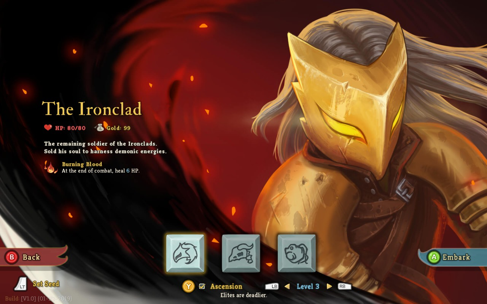
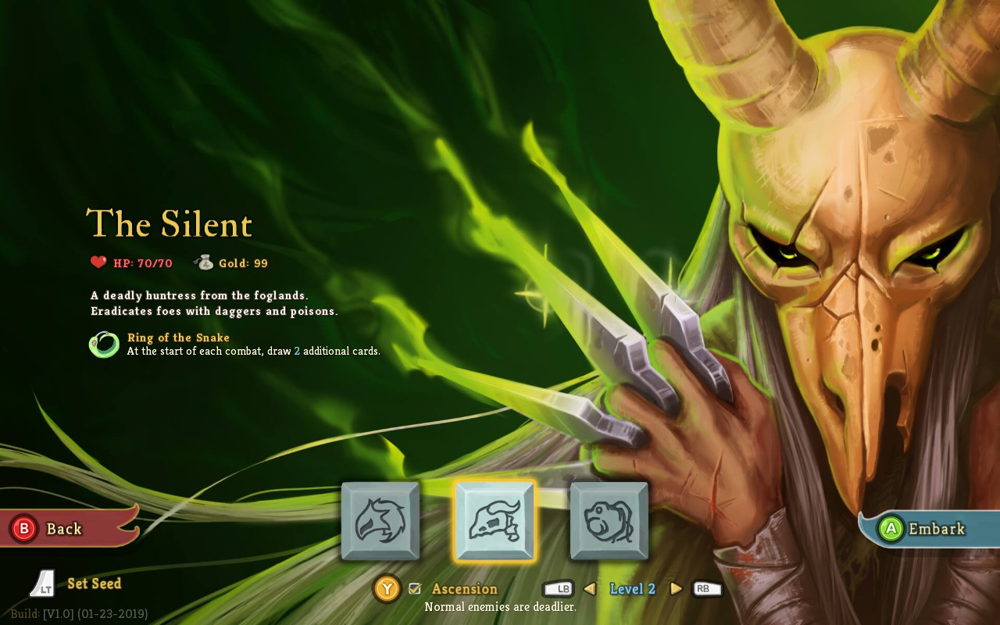
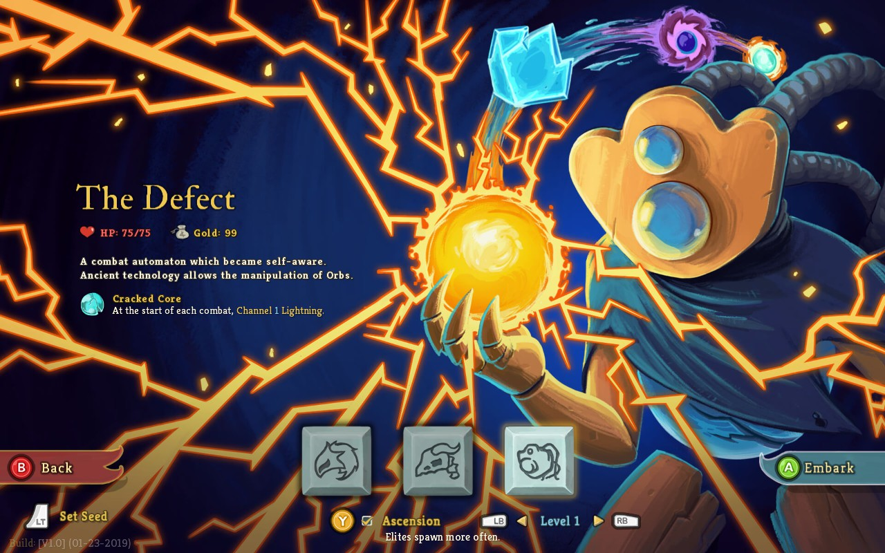

After choosing a character and difficulty. The player suddenly wakes up in the very bottom of the spire, with seemingly endless level. Your objective now is to struggle to go up to the highest level of the spire. 

If the player can keep ascending floor by floor without dying until reaching the highest floor which contains the heart of the spire, the source of all evil. After you dealt certain damage to the heart, suddenly your consciousness fades and fainted.
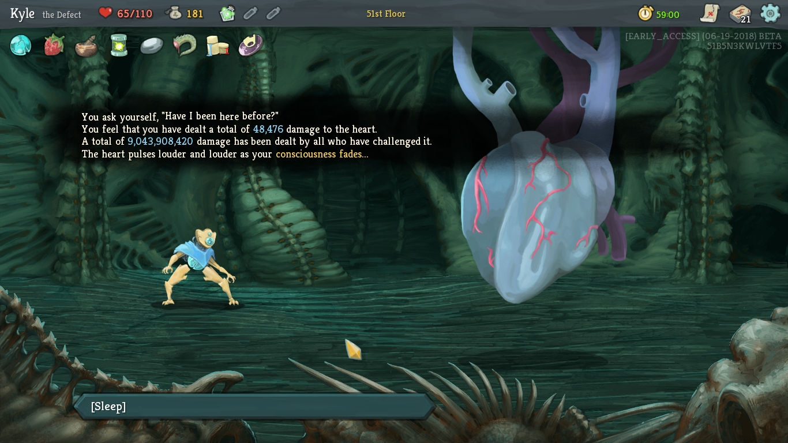

### Boundaries

- In the game player can only ascend to the next floor, unable to descend to lower floor.
- If player died not only he needs to restart from floor 1 he also lost all the cards and artfacts obtained from previous run.

### Rule of Interaction
- In order to defeat enemy, player uses a set of cards containing action which could be performed.
- If player hp become 0, player will die.
- If enemy hp become 0, enemy will die.
- Relic passively activated depends on the conditions
- Potion can be used to gain various results

### Artifacts 

- Player

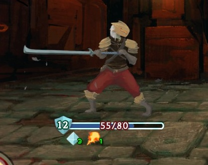
- Enemy

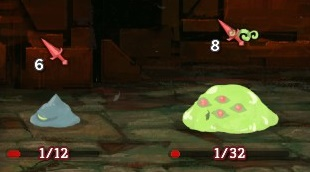

- Elite

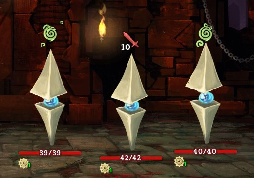

- Boss

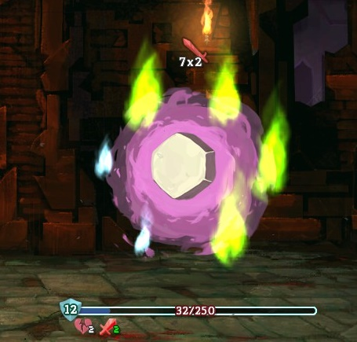

- Card

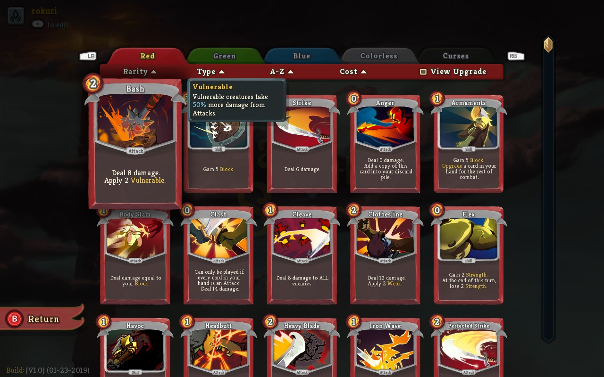

- Relic

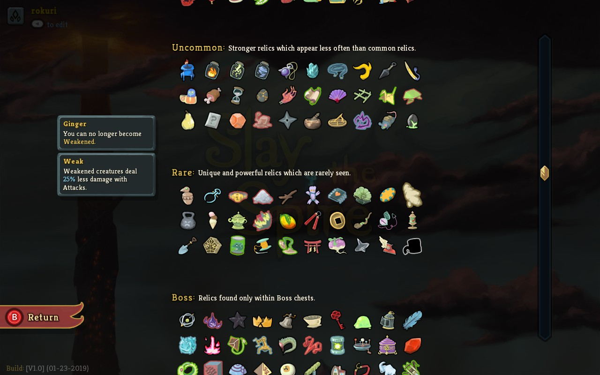
- Potion

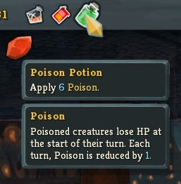
- Gold

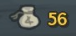
- Energy

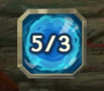
### Goal

Survive until the highest level and deal damage to the heart of the spire

## Gameplay 

### Game Rules
#### Fighting
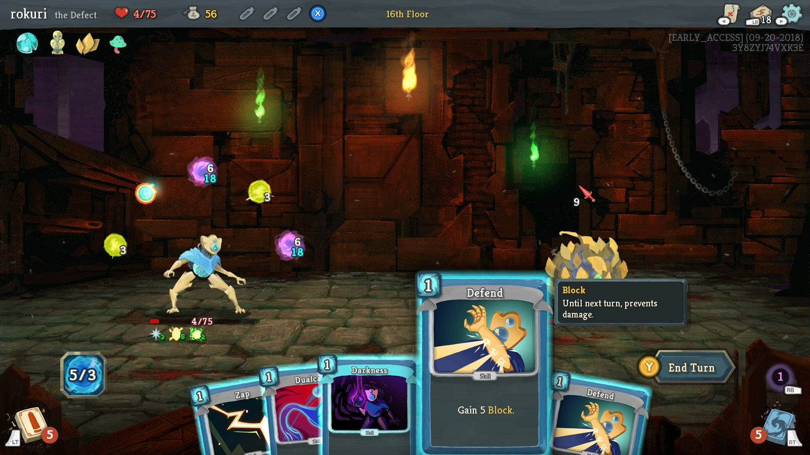

- In the start of player turn, player receives number of cards.
- After card used, the card will be placed on the discard pile
- Cards in the discard pile will be shuffled into draw pile when it run out of cards.
- Player have a number of energy which can be used to perform card.
- Player can end turn at any time in the game, letting the enemy to perform.
- Relic will always activated, depends on the effect and conditions.
- At any point of the game, player can choose to use a potion to gain it's effects.
- After killing the enemy, player gains loot

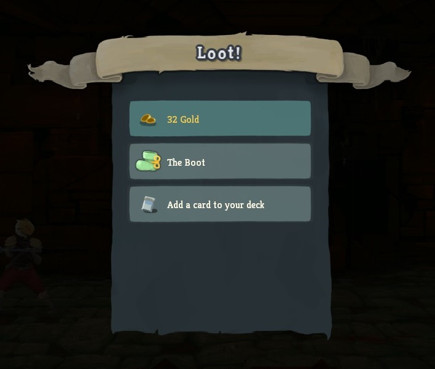
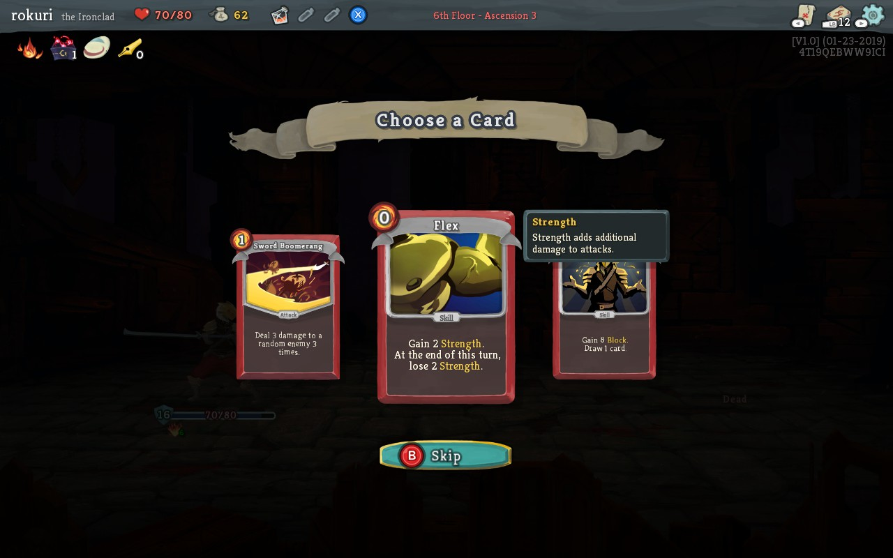

#### Non-Fighting

- In the tent area, player can either rest or upgrade card

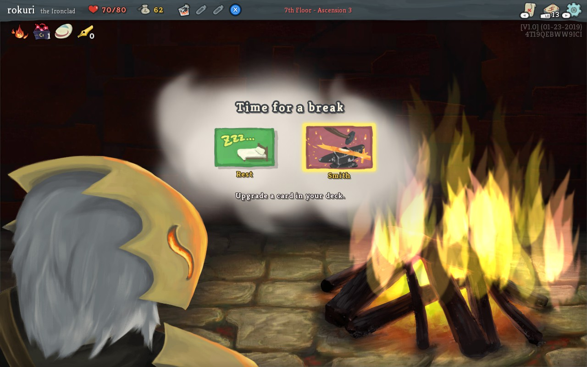
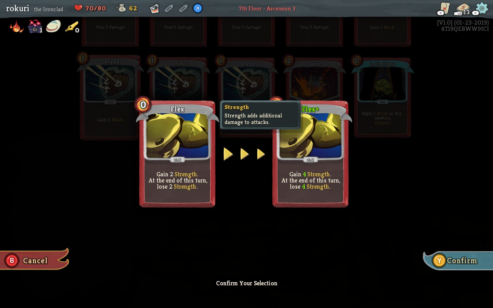

- In the merchant area, player spend gold to buy card, potion, and relic

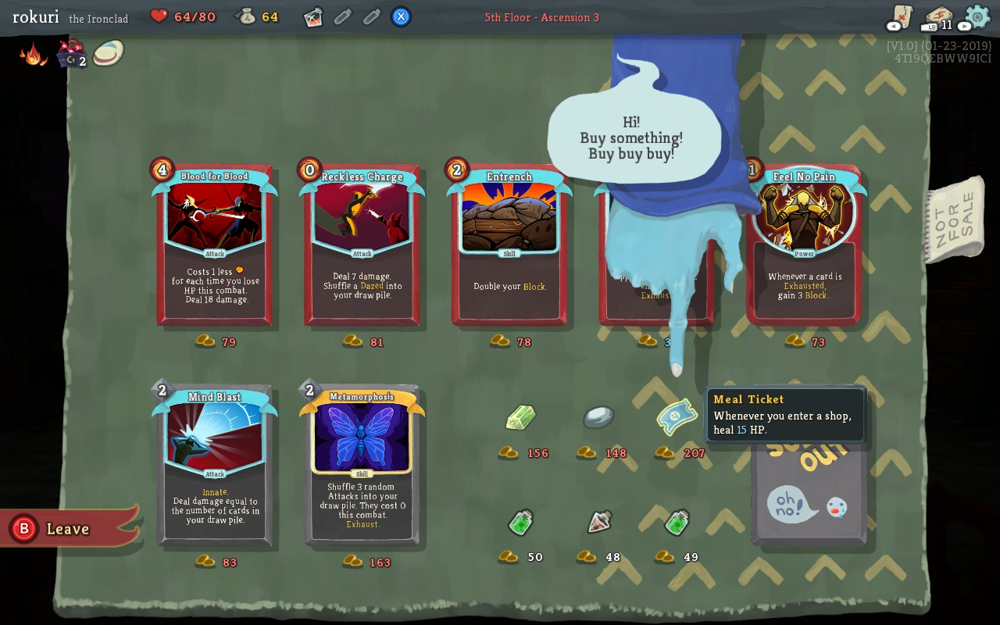

### Plot
The player wakes up on the first floor on the spire. Then the player tries to reach the highest floor on the spire. On the highest level of the spire there's the heart of the spire, player deal some damage then fainted. After waking up, player realized he's on the first floor of the spire again, and lost all his golds, potions, cards, and relics.

### Objectives

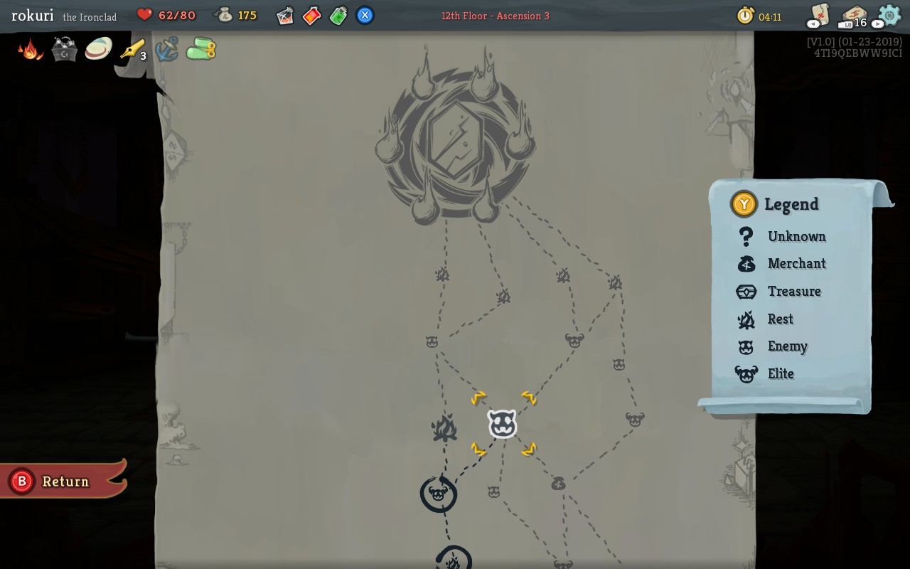

Player can advance to higher floor after finish task within the floor which is :
- **Enemy** Player finished killing all the enemy(ies)
- **Elite** Player finished killing elite enemy(ies)
- **Merchant** Player finished shopping and leave the shop
- **Treasure** Player opened the treasure box
- **Rest** Player finished either rest or upgrading a card
- **Boss** Player finished killing the boss
- **Unknown** Can contain any of the above

### Challenges

After you reach the heart of spire, you unlock the next ascension level. The  higher the ascension level, the bigger damage you can deal to the heart.

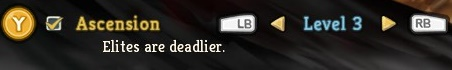
## Game Mechanics
- Status
    - **HP**     
    HP represents the health of the player and the opponents they encounter. Certain effects can reduce or increase the remaining and/or maximum HP of the player. HP persists throughout each Act of the game. After successfully defeating the Boss of an Act the player is fully healed. Once the remaining HP of the player reach 0 they die and the game is over.

    - **Damage**     
    Attacks deal damage. Unblocked damage results in loss of HP.
    
    - **Block**     
    Block applies shields to any combatant for one turn of combat. The intensity of the shields determines how much damage it can take before breaking. Whenever a blocking target receives damage the shields are reduced first. Once an attack exceeds the shield intensity it breaks and the target starts taking HP damage. Unless prevented by other means all applications of Block are removed at the start of each turn in combat.
    
- Combat Conditions
    - **Weakened**    
         This unit deals 25% less damage with attacks
    - **Vulnerable**    
         This unit receives 50% more damage from attacks
    - **Strengh**    
         This unit deals X additional damage with attacks
    - **Artifact**    
         Negates X incoming debuffs 	Intensity 	
    - **Thorns**    
         Deals X damage to any attacker 	Intensity 
    - **Barricade**    
         Prevents removal of Block at the start of turn 	
    - **Metallicise**    
         This unit gains X Block at the end of their turn 	
    - **PlatedArmor**    
         This unit gains X Block at the end of their turn, taking unblocked damage removes one
    - **Intangible**    
         All incoming damage and life loss is reduced to 1 
    - **Frail**    
         This unit applies 25% less block with 
    - **Dexterity**    
         This unit applies X additinoal block with cards
    - **Entangled**    
         This unit cannot play Attack cards 	Duration
    - **Flex**    
         This unit loses X strength at the end of turn
    - **Blur**    
         Block is not removed at the beginning of the next X turns 
    - **DrawReduction**    
         Draw 1 less card at the start of the next X turns
    - **Minion**    
         This unit abandons combat if only minions remain 
    - **Posion**    
         This unit loses X HP at the start of each turn and then removes 1 application of poison
    - **Shackled**    
    This unit regains X Strength at the end of turn 

- Card Types
        
    - **Attack**   
    Usually deal direct damage to one or more enemies, with some adding a secondary effect. 

    - **Skill**   
    All sorts of temporary and strategic effects are in this card type. Commonly grant Block or other temporary buffs to the player or debuffs to one or more enemies. 

    - **Power**   
    A permanent upgrade for the entire combat encounter. Some Powers give flat stats like Strength or Dexterity, others require certain conditions to be met or add beneficial effects whenever a certain event occurs in battle. Once played, the Power card is removed for that combat. 

    - **Status**   
    Unplayable cards added to the deck during combat encounters. They are designed to bloat the deck and prevent the player from drawing beneficial cards, with some of them having additional negative effects. Unlike Curses, Status cards are removed from the deck at the end of combat. 

    - **Curse**   
    Unplayable cards added to the deck during in-game events. Similar to status cards they are designed to bloat the deck and prevent the player from drawing beneficial cards, with some of them having additional negative effects during combat. Unlike Statuses, Curse cards persist in the players' deck until removed by other means

- Card Effects

    - **Unplayable**    
      Cards that cannot be played normally, unless otherwise altered, and hence have no Energy cost.
    - **Exhaust**    
      Cards that are exhausted are removed from the players' deck until the end of the encounter.
    - **Ethereal**    
     Cards that exhaust themselves if left in the players' hand at end of turn. 
    - **Innate**    
     Cards that are innate are guaranteed to be in the players' starting hand.
    - **Retain**    
     Cards that are kept after ending your turn

    